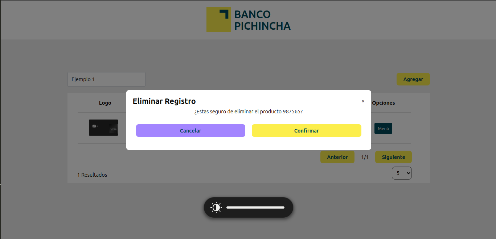
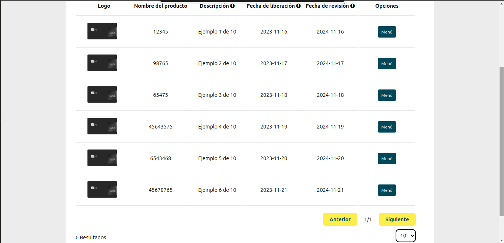
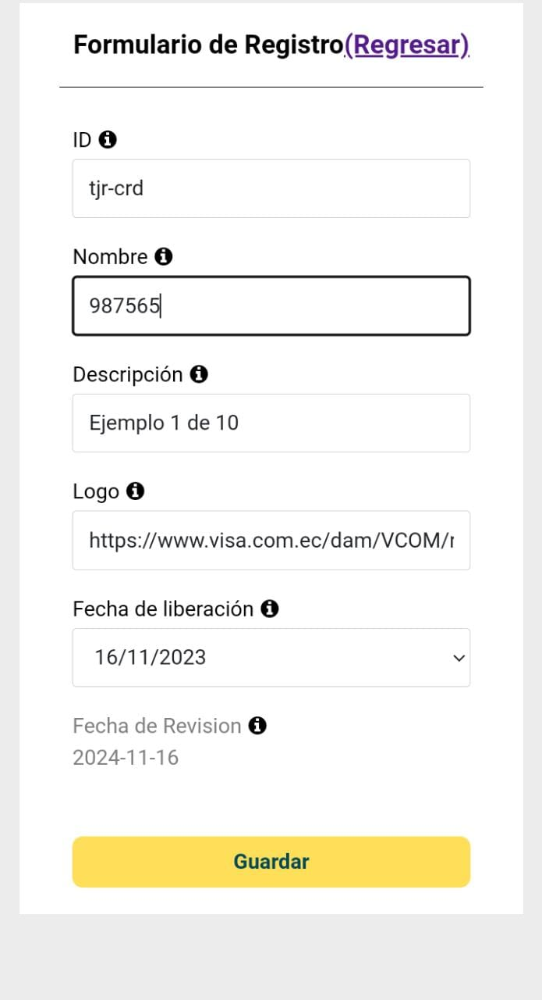
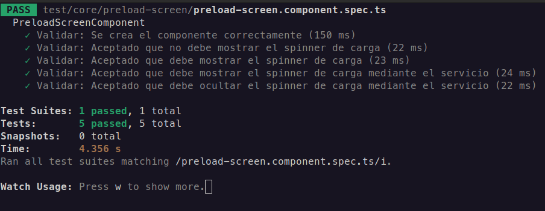

<h1>
  
  BANCO PICHINCHA
</h1>

## Requisitos iniciales
- Nodejs (v18.18.2)
- Cli de Angular (v16.2.10 o superior)
- npm o npm
## Comandos
- Clonar el repositorio 
```bash
git clone https://github.com/MS-Marcks/banco-pichincha.git
```
- Instalación de módulos (estando en la carpeta del proyecto)
```bash
npm install
```
- o bien puede hacerlo con pnpm  (estando en la carpeta del proyecto)
```bash
pnpm install
```
- Iniciar el servidor de desarrollo  (estando en la carpeta del proyecto)
```bash
npm start
```
- Iniciar la ejecución servidor de desarrollo  (estando en la carpeta del proyecto)
```bash
npm run test
```

 ## Ruta de las <a href="./test/">Pruebas</a>

## Aplicación
Aplicación para visualizar los diferentes productos financieros ofertados por la institución Bancaria Pichincha cargados a una API

### Vista Desktop







### Vista Mobile





### Unit Test





